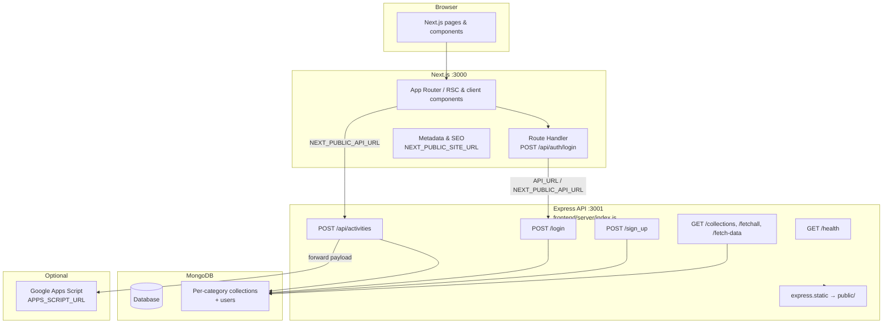

# FACTACTO - Faculty Activity Tracking & Collaboration

Web application for faculty to submit activity data (publications, conferences, projects, and related categories), with dashboards, admin views, and optional forwarding to Google Apps Script. The UI is a **Next.js** (App Router) app; persistence and auth are handled by a separate **Express** API backed by **MongoDB**.

---

## Architecture

High-level flow: the browser talks to Next.js on port **3000**. The Next app serves pages and a small **Route Handler** for login that proxies to Express. Faculty form submissions and other API calls go from the browser (or server) to Express on port **3001**, which reads and writes MongoDB.



**Ports (local development)**

| Service    | Port | Command              |
|-----------|------|----------------------|
| Next.js   | 3000 | `npm run dev`        |
| Express   | 3001 | `npm run dev:api`    |

---

## Software principles used

These are reflected in how the repo is structured and how requests are handled:

- **Separation of concerns** - UI and routing live in Next.js (`src/app`, `src/components`). Business rules for categories and collection naming live in shared libs (`src/lib/categories.js`, `server/lib/categoryCollections.js`). The Express server owns HTTP APIs, JSON limits, and MongoDB access.
- **Thin edge, explicit backend** - The Next Route Handler for login (`src/app/api/auth/login/route.js`) proxies to Express so the browser does not need to call the Express origin directly for that flow; form posts still target the configured API base (`NEXT_PUBLIC_API_URL`).
- **Configuration via environment (12-factor style)** - Behavior is driven by env vars (`frontend/.env` for the API server; Next also supports `.env.local`). Secrets are not committed; use `.env.example` as a template.
- **Secure credential handling** - Passwords are stored with **bcrypt** hashes. Admin password from env is compared with **timing-safe** equality where applicable. Roles are derived from configuration (`ADMIN_ROLE_EMAIL`) rather than client input.
- **Defense in depth for errors** - User-facing error messages for activity save are sanitized; detailed errors are logged server-side (`server/index.js`).
- **Schema-by-convention** - Activity categories map to MongoDB collection names via a single mapping layer (slug → collection name), keeping forms and storage aligned.
- **Optional integration boundary** - Submissions can be forwarded to **Google Apps Script** when `APPS_SCRIPT_URL` is set, without coupling the core save path to that integration.

---

## Prerequisites

- **Node.js** (LTS recommended; matches Next 16 / React 19)
- **npm** (or compatible client)
- **MongoDB** reachable from your machine — local `mongodb://` URI or **MongoDB Atlas** (`MONGO_URI` or `MONGODB_URI` + username/password)

---

## Repository layout (app)

| Path | Role |
|------|------|
| `src/app/` | Next.js App Router: pages, layouts, metadata |
| `src/components/` | UI components (forms, dashboards, etc.) |
| `src/lib/` | Client/server helpers (`api.js`, categories) |
| `server/index.js` | Express API entry |
| `server/lib/` | Server-only helpers (e.g. category → collection names) |
| `server/scripts/` | One-off scripts (e.g. seed collections) |
| `public/` | Static assets served by Next and by Express |

---

## Environment variables

1. Copy the example file and edit values:

   ```bash
   cd frontend
   copy .env.example .env
   ```

   On macOS/Linux: `cp .env.example .env`

2. **Important:** The Express API loads **`frontend/.env` only** (see `server/index.js`). Next.js may also read `.env.local` for public/build-time vars—keep API secrets out of `NEXT_PUBLIC_*` keys.

### Required for the API to start

| Variable | Purpose |
|----------|---------|
| `MONGO_URI` | Full MongoDB connection string **or** |
| `MONGODB_URI` + `MONGODB_USERNAME` + `MONGODB_PASSWORD` | Atlas-style split vars (built into a URI in code) |
| `DB_NAME` or `MONGODB_DB_NAME` | Database name (default `mdb`) |

### Recommended for local full stack

| Variable | Purpose |
|----------|---------|
| `PORT` | Express port (default **3001**) |
| `NEXT_PUBLIC_API_URL` | Base URL for the Express API (e.g. `http://localhost:3001`) — used by the browser for `/api/activities` |
| `API_URL` | Used by the Next login Route Handler to reach Express (e.g. `http://127.0.0.1:3001`) |

### Auth and roles

| Variable | Purpose |
|----------|---------|
| `ADMIN_EMAIL` | Comma-separated emails allowed to use `ADMIN_PASSWORD` for login |
| `ADMIN_PASSWORD` | Plain password for those admin emails (hashed on use / stored in MongoDB) |
| `ADMIN_ROLE_EMAIL` | Email that receives `role=admin`; others get `faculty` |
| `ADMIN_PASSWORD_HASH` | Optional: seed hash instead of plain `ADMIN_PASSWORD` |

### Optional

| Variable | Purpose |
|----------|---------|
| `NEXT_PUBLIC_SITE_URL` | Canonical site URL for SEO (Open Graph, metadata base) |
| `APPS_SCRIPT_URL` | Forward each activity payload to Google Apps Script after save |
| `JSON_BODY_LIMIT` | Override JSON body limit for activities (see `.env.example`) |

See **`frontend/.env.example`** for full comments and defaults.

---

## Database setup

### Ensure category collections exist

After MongoDB is configured in `.env`, you can create empty collections for all FACTACTO categories:

```bash
cd frontend
npm run db:seed-collections
```

This uses `server/scripts/seed-collections.js` and the same category definitions as `server/lib/categoryCollections.js`.

---

## Running the app (development)

Always run commands from the **`frontend`** directory.

### Option A - One command (Next + Express)

Requires `concurrently` (already in `devDependencies`):

```bash
npm install
npm run dev:full
```

- Open **http://localhost:3000** for the app.
- Express listens on **http://localhost:3001** (check terminal output).

### Option B - Two terminals

**Terminal 1 - Next.js**

```bash
npm run dev
```

**Terminal 2 - Express API**

```bash
npm run dev:api
```

### Verify the API

```bash
curl http://localhost:3001/health
```

Expected: JSON `{ "ok": true }`.

---

## Production build

**Next.js** (static optimization and Node server for pages):

```bash
cd frontend
npm install
npm run build
npm start
```

By default Next serves on port **3000** (set `PORT` if needed). Run the **Express** API as a separate process (same repo: `node server/index.js` or `npm run dev:api` with `NODE_ENV=production`), on a host that can reach MongoDB. Set:

- `NEXT_PUBLIC_API_URL` - public URL of the Express API (HTTPS in production).
- `API_URL` - URL the Next server uses to proxy login to Express (often the same as `NEXT_PUBLIC_API_URL` if the API is public).
- `NEXT_PUBLIC_SITE_URL` - public URL of the Next site for metadata.

Deploy the UI and API separately: **Vercel** for Next.js and **Render** (free web service) for Express. Env semantics match the list above.

---

## Deployment: Vercel + Render

**Order:** MongoDB Atlas → Render (API) → Vercel (Next). Point Vercel at the Render API URL only after Render is live.

### 1. MongoDB Atlas

1. Create a cluster (e.g. **M0** free), database user, and note **`MONGO_URI`** (or use split `MONGODB_*` variables as in `.env.example`).
2. **Network Access:** allow **`0.0.0.0/0`** so Render’s outbound IPs can connect (you can narrow this later).

### 2. Render - Express API

1. Sign up at [render.com](https://render.com) and connect your **GitHub** account.
2. **New** → **Web Service** → select this repository.
3. **Configuration**

   | Setting | Value |
   |---------|--------|
   | **Root Directory** | `frontend` |
   | **Runtime** | Node |
   | **Build Command** | `npm install` |
   | **Start Command** | `node server/index.js` |
   | **Instance type** | **Free** (cold start after ~15 min idle; first request may be slow) |

4. **Environment** (Render dashboard → your service → **Environment**), add at least:

   | Variable | Purpose |
   |----------|---------|
   | `MONGO_URI` | Atlas connection string (or `MONGODB_URI` + `MONGODB_USERNAME` + `MONGODB_PASSWORD`) |
   | `DB_NAME` or `MONGODB_DB_NAME` | e.g. `mdb` |
   | `ADMIN_EMAIL` | Comma-separated admin emails |
   | `ADMIN_PASSWORD` | Plain password for those emails |
   | `ADMIN_ROLE_EMAIL` | Email that receives `admin` role |
   | `APPS_SCRIPT_URL` | Optional |

   Do **not** set `PORT` manually — Render injects `PORT`; the server already uses `process.env.PORT`.

5. **Create Web Service** and wait for deploy. Copy the public URL (e.g. `https://factacto-api.onrender.com`).

6. **Verify:** open `https://YOUR-RENDER-SERVICE.onrender.com/health` — expect `{"ok":true}`.

### 3. Vercel — Next.js

1. Sign up at [vercel.com](https://vercel.com) and **Add New Project** → import the **same** GitHub repo.
2. **Configure**

   | Setting | Value |
   |---------|--------|
   | **Root Directory** | `frontend` |
   | **Framework Preset** | Next.js |
   | **Build Command** | `npm run build` (default) |
   | **Output** | default |

3. **Environment Variables** (Production; add **Preview** too if previews should call a real API):

   | Name | Value |
   |------|--------|
   | `NEXT_PUBLIC_API_URL` | `https://YOUR-RENDER-SERVICE.onrender.com` (no trailing slash) |
   | `API_URL` | Same as `NEXT_PUBLIC_API_URL` (login proxy server-side) |
   | `NEXT_PUBLIC_SITE_URL` | `https://YOUR-PROJECT.vercel.app` or your custom domain |

4. **Deploy**, then open the Vercel URL and test login and a form submission.

### 4. Custom domains (optional)

- **Vercel:** Project → **Domains** → add your site domain; update `NEXT_PUBLIC_SITE_URL`.
- **Render:** Service → **Settings** → **Custom Domain** for the API if you want e.g. `api.yourschool.edu`; then set **`NEXT_PUBLIC_API_URL`** and **`API_URL`** on Vercel to that HTTPS URL and **redeploy**.

### 5. Free-tier notes (Render)

- Services **spin down** after inactivity; the next request **wakes** the API (delay of seconds is normal).
- Render documents free limits in their [free tier docs](https://render.com/docs/free); not intended for heavy production load without upgrading.

---

## NPM scripts

| Script | Description |
|--------|-------------|
| `npm run dev` | Next.js dev server (:3000) |
| `npm run dev:api` | Express API (:3001) |
| `npm run dev:full` | Both via `concurrently` |
| `npm run build` | Production build |
| `npm start` | Start production Next server |
| `npm run db:seed-collections` | Seed empty MongoDB collections for categories |

---

## Learn more

- [Next.js documentation](https://nextjs.org/docs)
- [Express](https://expressjs.com/)
- [MongoDB Node driver](https://www.mongodb.com/docs/drivers/node/current/)
